# Luminare

Luminare is a SwiftUI framework designed to enhance the development of macOS applications by providing a collection of pre-styled components that adhere to a consistent design language. It simplifies the creation of visually appealing and functional user interfaces.

## Features

- **Adopts a declarative syntax** that is consistent with SwiftUI.
- **Emphasizes modularity and reusability**, allowing developers to create custom interfaces with minimal boilerplate code.
- Uses a combination of system-defined and custom modifiers to apply **consistent styling** across different components.

## Add to your Project

To add Luminare to your Xcode project, you can use Swift Package Manager (SPM). Follow these steps:

1. Open your project in Xcode.
2. Go to `File` > `Swift Packages` > `Add Package Dependency...`.
3. Enter the repository URL for Luminare.
4. Select the version you want to use and add it to your project.

## Components

Luminare offers a variety of components, organized for easy reference:

| Component Type | Component | Preview |
|----------------|-----------|---------|
| Buttons | `LuminareButtonStyle` | 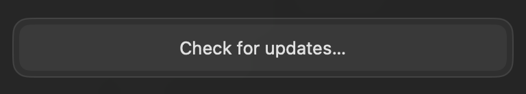 |
|  | `LuminareDestructiveButtonStyle` | 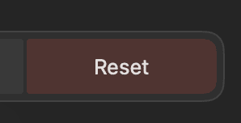 |
|  | `LuminareCompactButtonStyle` | 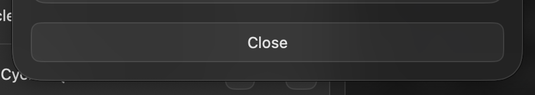 |
|  | `LuminareCosmeticButtonStyle` | 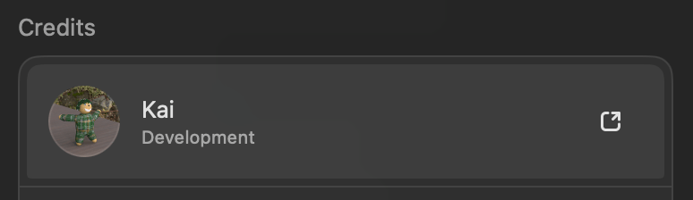 |
| Toggle Buttons | `LuminareToggle` | 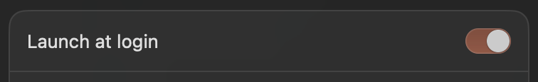 |
| Value Adjusters | `LuminareValueAdjuster` |  |
| Pickers | `LuminarePicker` | 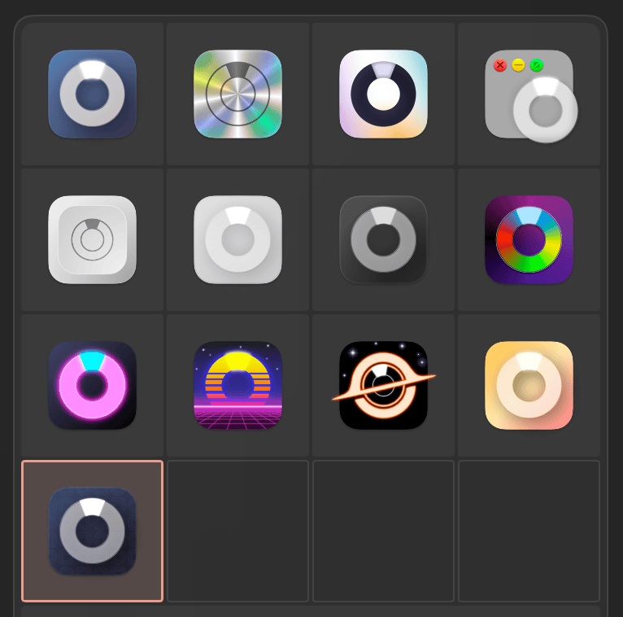 |
|  | `LuminareSliderPicker` | 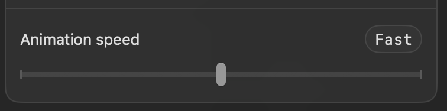 |
| Color Picker | `LuminareColorPicker` | 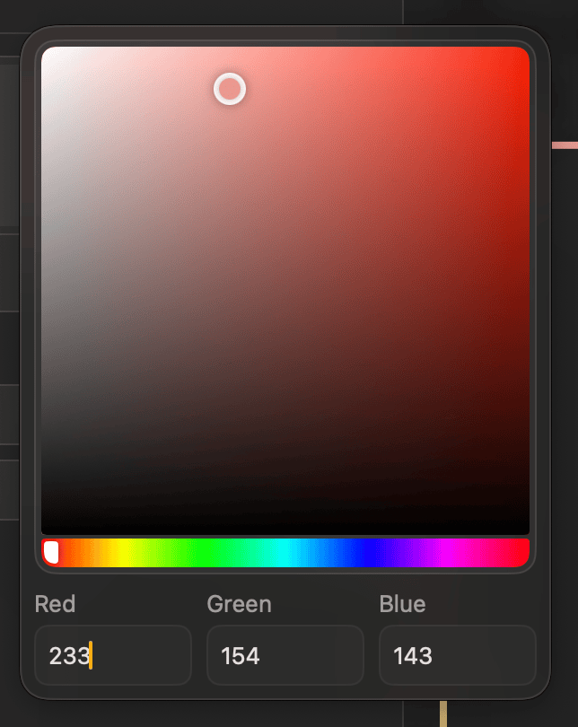 |
| Text Field | `LuminareTextField` | 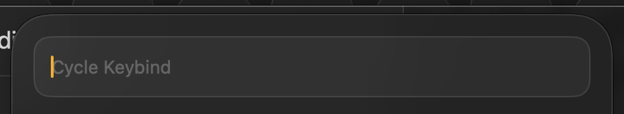 |
| Modal Views | `.luminareModal(...)` |  |
| Sections | `LuminareSection` | 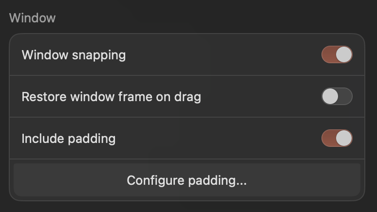 |
| Lists | `LuminareList` | 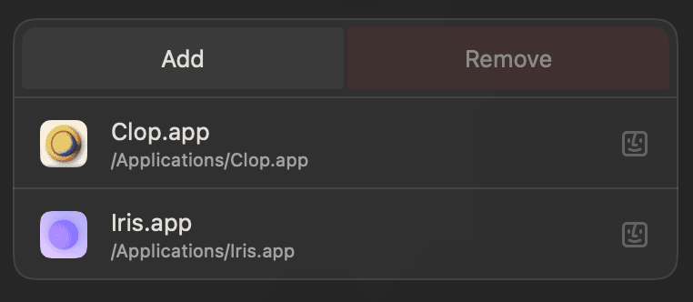 |

## Example Usage

Luminare can be used pretty much exactly like how you would use SwiftUI. For a practical example, please check [Loop's code](https://github.com/MrKai77/Loop/blob/1b6e4f8555be2dfaf4e0ae0225224d71d36a5078/Loop/Luminare/Settings/Behavior/BehaviorConfiguration.swift#L97).

## License

Luminare is released under the MIT License. See the [LICENSE](LICENSE) file in the repository for the full license text.
