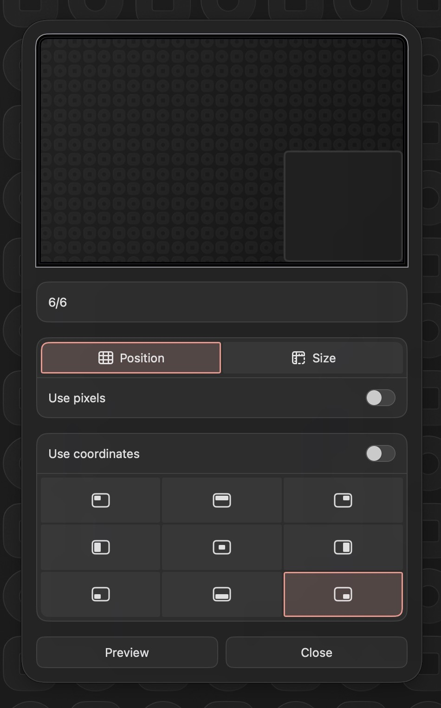

# Luminare

 Luminare is a SwiftUI framework designed to enhance the development of macOS applications by providing a collection of pre-styled components that adhere to a consistent design language. It simplifies the creation of visually appealing and functional user interfaces.

## Features

 - **Adopts a declarative syntax** that is consistent with SwiftUI. 
 - **Emphasizes modularity and reusability**, allowing developers to create custom interfaces with minimal boilerplate code. 
 - Uses a combination of system-defined and custom modifiers to apply **consistent styling** across different components.

## Add to your Project

To add  to your Xcode project, you can use Swift Package Manager (SPM). Follow these steps:

1. Open your project in Xcode.
2. Go to `File` > `Swift Packages` > `Add Package Dependency...`.
3. Enter the repository URL for Luminare.
4. Select the version you want to use and add it to your project.

## Components

Luminare offers a variety of components, including:

- **Buttons**: Customizable buttons with predefined styles:
    - `LuminareButtonStyle`  
</img>
    - `LuminareDestructiveButtonStyle`  
</img>
    - `LuminareCompactButtonStyle`  
</img>
    - `LuminareCosmeticButtonStyle`  
</img>
- **Toggle Buttons**: `LuminareToggle`, a toggle switch view with a clean design.  
</img>
- **Value Adjusters**: `LuminareValueAdjuster`, a slider with an input field for numerical values.  
</img>
- **Pickers**: Custom picker views for selecting options, demonstrated by:  
    - `LuminarePicker`  
</img>
    - `LuminareSliderPicker`  
</img>
- **Color Picker**: `LuminareColorPicker`, for choosing and setting colors.  
</img>
- **Text Field**: `LuminareTextField`, a styled textbox.  
</img>
- **Modal Views**: With the `.luminareModal(...)` modifier, support Luminare-styled modals.  
</img>
- **Sections**: `LuminareSection`, used to group related components.  
</img>
- **Lists**: `LuminareList`, built on SwiftUI's `List`, for displaying collections of items.  
</img>

## Example Usage

Luminare can be used pretty much exactly like how you would use SwiftUI. Please check [Loop's code](https://github.com/MrKai77/Loop/blob/1b6e4f8555be2dfaf4e0ae0225224d71d36a5078/Loop/Luminare/Settings/Behavior/BehaviorConfiguration.swift#L97) for reference.

## License

Luminare is released under the MIT License. You can find the full license text in the LICENSE file included in the repository.
